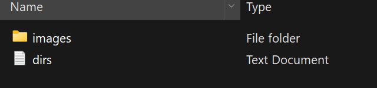
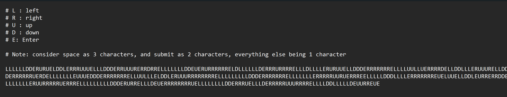
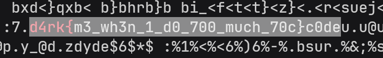
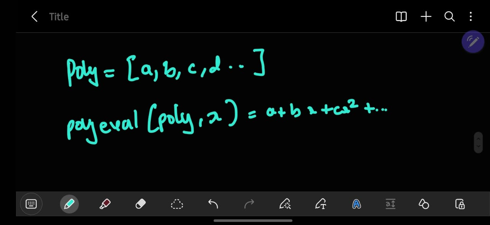
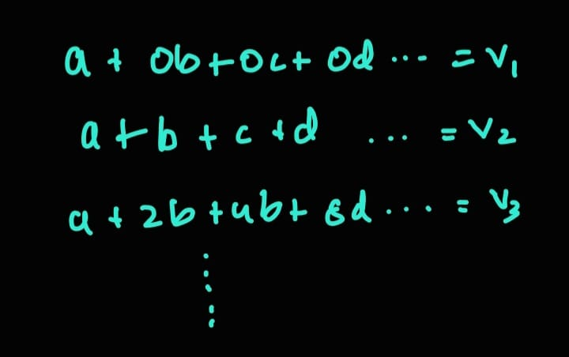
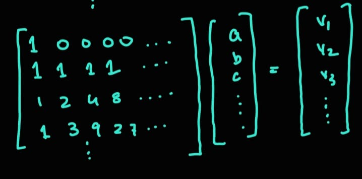
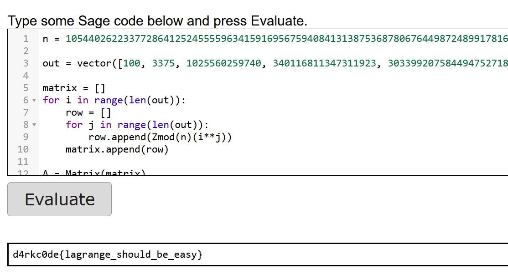
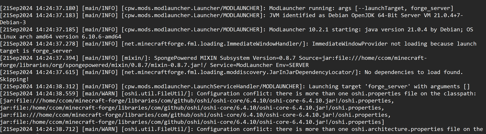
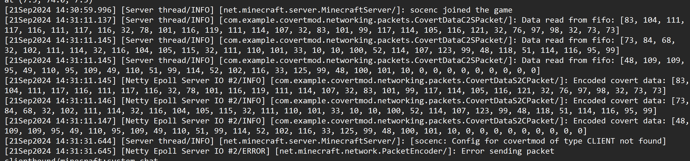
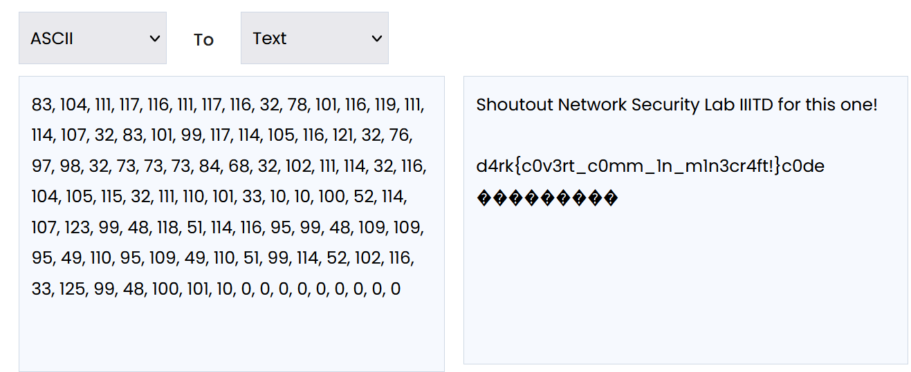

# d4rkc0de CTF Writeup

#### By Shawn Theo Moses

### TV Password

From the challenge website we get a zip file with a folder (images) and a text document called (dirs)



On opening the text document (dirs) we can see the the following contents.



The challenge's name suggests it is related to TV remotes and such. In TVs, we generally use another remote to perform operations on a virtual keyboard using up, down, left, right and enter buttons. 

Looking at the images folder, we find a bunch of images (as expected)


Looks like the layouts that we see on a keyboard. We can quickly start writing a Python script to emulate the operations displayed in the text file.

However, there’s one problem, we don’t know where to start. A quick fix to this is to just simulate all possible starting positions and then find the flag in the mess.

Here’s a script that I wrote for this purpose.

```python
layout_1 = [['q', 'w', 'e', 'r', 't', 'y', 'u', 'i', 'o', 'p' ],
        	['a', 's', 'd', 'f', 'g', 'h', 'j', 'k', 'l', '@' ],
        	['l2', 'z', 'x', 'c', 'v', 'b', 'n', 'm', '.', 'ba' ],
        	['l3', '<', '>', ' ', ' ', ' ', '-', '_', 'su', 'su' ] ]

layout_2 = [['Q', 'W', 'E', 'R', 'T', 'Y', 'U', 'I', 'O', 'P' ],
        	['A', 'S', 'D', 'F', 'G', 'H', 'J', 'K', 'L', '@' ],
        	['l1', 'Z', 'X', 'C', 'V', 'B', 'N', 'M', '.', 'ba' ],
        	['l3', '<', '>', ' ', ' ', ' ', '-', '_', 'su', 'su' ] ]

layout_3 = [['1', '2', '3', '4', '5', '6', '7', '8', '9', '0' ],
        	['@', '#', '$', '_', '&', '-', '+', '(', ')', '/' ],
        	['l4', '*', '\"', '\'', ':', ';', '!', '?', '%', 'ba' ],
        	['l1', '<', '>', ' ', ' ', ' ', '.', ',', 'su', 'su' ] ]

layout_4 = [['q', 'w', 'e', 'r', 't', 'y', 'u', 'i', 'o', 'p' ],
        	['a', 's', 'd', 'f', 'g', 'h', 'j', '{', '}', '@' ],
        	['l3', 'z', 'x', 'c', 'v', 'b', 'n', 'm', '.', 'ba' ],
        	['l1', '<', '>', ' ', ' ', ' ', '-', '_', 'su', 'su' ] ]

moves = 'LLLLLLDDERURUELDDLERRRUUUELLLDDDERRUUURERRDRRELLLLLLLDDEUERURRRRRRELDLLLLLLDERRRURRRRELLLDLLLLERURUUELLDDDERRRRRRRELLLLUULLUERRRRDELLDDLLLERUUURELLDDDERRRRRRUERDELLLLLLLEUUUEDDDERRRRRRRELLUULLLELDDLERUUURRRRRRRRELLLLLLLLLDDDERRRRRRRELLLLLLLERRRRRUURUERRREELLLLLDDDLLLLERRRRRRREUELUUELLDDLEURRERRDDELLLLLLLERUURRRRRUERRRELLLLLLLLLDDDERURRELLLDEUERRRRRRRRUELLLLLLLLDDERRRUELLLDERRRRRUUURRRRELLLLDDLLLLLDEUURREUE'

curr_x = 0
curr_y = 0
ans = ""

layouts = [layout_1, layout_2, layout_3, layout_4]
for curr_lay in layouts:
	for curr_x in range(4):
    	for curr_y in range(10):
        	for move in moves:
            	nextmove = move
            	# print(nextmove)
            	if (nextmove == 'L'):
                	curr_x = (curr_x + 10 - 1)%10
            	if (nextmove == 'R'):
                	curr_x = (curr_x + 1)%10

            	if (nextmove == 'U'):
                	curr_y = (curr_y + 4 - 1)%4
            	if (nextmove == 'D'):
                	curr_y = (curr_y + 1)%4
           	 
            	if (nextmove == 'ba'):
                	gr = gr[:-1]

            	if (nextmove == 'E'):
                	gr = curr_lay[curr_y][curr_x]
                	if (gr == 'l1'):
                    	curr_lay = layout_1
                	elif (gr == 'l2'):
                    	curr_lay = layout_2
                	elif (gr == 'l3'):
                    	curr_lay = layout_3
                	elif (gr == 'l4'):
                    	curr_lay = layout_4
                	else:
                	    ans += gr
        	print(ans + "\n")
```
Executing this script yields all possible strings that could have been written from all possible starting positions. (Note that I ignored the symbols for the 4th layout except {} as it they are not relevant to the flag).
But we know that the flag starts with `d4rk{`

Executing this file and then piping it into `grep` would help us find the flag
doing this gives us..




flag obtained!
`d4rk{m3_wh3n_1_d0_700_much_70c}c0de`


### SSS1

On opening the challenge we are provided with 2 files
1 `sss.py` and one `output.txt`

on opening the `sss.py` file
we can see a python script.

```python
from sage.all import *
from Crypto.Util.number import *
from secret import flag
t, nbits = 20, 1024
n = getPrime(nbits)

polyeval = lambda poly, x: sum(Zmod(n)(poly[i])*x**i for i in range(len(poly)))

coeff = [i for i in flag]
out = [polyeval(coeff , i) for i in range(len(flag))]
print(f"out = {out}")
print(f"n = {n}")
```

in this script we have a lambda function which called polyeval, it looks like its computing the value of 



and the output looks like its computing the value of 
`polyeval(coeff, i)` for all values of i from `0` to `len(flag)`

using this we can construct a bunch of equations and equate them to our outpus. The thing that we need to find is the coeff list as that pretty much contains our flag

The equations we get are of the form.. 


We can simplify this equation into the following matrix by taking `[a, b, c, d .. ]` as a vector.

We get the following linear equation


We can solve this with the same tools provided in SageMath and using the `solve_right` function


```py
n = 105440262233772864125245555963415916956759408413138753687806764498724899178162583977481246130298999018657820217510835588798652181438439757590722217562108703880636460732169436845107103279078924024126335306746022223589913016069615472977510887273514085624862971467876539667023860407515133670709544158325349557429

out = vector([100, 3375, 1025560259740, 340116811347311923, 3033992075844947527188, 3603660194622344868275335, 1185067861652606417705311900, 160102437808262275455847183755, 11261437464395741451157599364228, 480765428427554142530833457469343, 13835816186209265625095391415909020, 289323859679138777863995790015427875, 4646841925271978291344125412775405620, 59791198916440264522048926860382763383, 636896542585440555032290476792106686748, 5764409956806031718790741887363319740155, 45270158361252736366691292226470023931300, 313834940254006749339837074445682851032335, 1948076074745630146690028854573590625311388, 10957397000814745367523586769734594829264403, 56414518954546498791018619123330260650342740, 268163962695739259173334931697523174730147175, 1185654249471761626945413825617980594145535900, 4907459224973946757272589072991469179665915243, 19121985116803168322122821276340986478040762308, 70489662673708794867255615594582702972921275775, 246900080338260946527576735409542736435225145500, 824886262016659178109914843632453176146778253315, 2637759593350564868698832841266602982580861336948, 8098024051870898675628613456271851262152564965463, 23934504221526048050969591444910751684377319583260, 68273523546719598656577557925512124566068957741275, 188382612614810800056301048260828869834579097636580])

matrix = []
for i in range(len(out)):
    row = []
    for j in range(len(out)):
        row.append(Zmod(n)(i**j))
    matrix.append(row)
    
A = Matrix(matrix)
ans = A.solve_right(out)

for i in ans:
    print(chr(i), end="")
```

We generate the matrix and then solve it. Using this we get the flag. 



We got the flag! `d4rkc0de{lagrange_should_be_easy}`


### Mine It Up!

On opening the challenge we get a file. On opening we can see this.



It looks like some minecraft server logs.

On scrolling through it we can see some stuff..


 
looks kinda suspicous. reminds me of ASCII values ngl..

Lets convert it with a online tool.



Seems like we were right, this was the flag.
`d4rk{c0v3rt_c0mm_1n_m1n3cr4ft!}c0de`